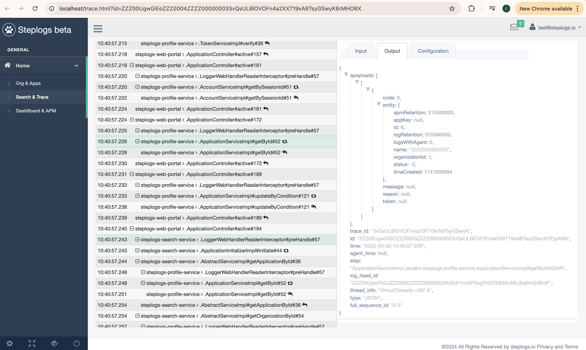

# For logger usage #

** There are two types of logging. **


- 1, On method

> `Mark @Logging on the method to log the parameters/returns for the methods, by default`

```java
@Logging
TypeABC func(String str) { // line 233
  // first line better right next
  //do some work
  return TypeABC
}
 
Object caller(){
  return func("str123");//line 456
}
```

> log: ...|package.class#func#234#|[str123]

> log: ...|package.class#func#234#R|[TypeABC->toJson]

Sample:
> 2025-03-30 19:15:37.151|VirtualThreads--69-5|7EHjY7VJ7WzVp4DEvL8AOutFo3wkyqlu|4-2|JSON|AccountServiceImpl.java#io.steplogs.profile.service.AccountServiceImpl#getBySessionId#51#|[{"session_id":"ZwQwpVLp7Ly26qP9JEu6QI8LqP5ttUgE87la4xDaqqoXB0ir"}]
> 2025-03-30 19:15:37.154|VirtualThreads--69-5|7EHjY7VJ7WzVp4DEvL8AOutFo3wkyqlu|4-3|JSON|AccountServiceImpl.java#io.steplogs.profile.service.AccountServiceImpl#getBySessionId#51#R|[[{"code":0,"entity":{"email":"test@steplogs.io","id":1,"login":"test@steplogs.io","organizationId":1,"password":null,"retries":0,"sessionId":"ZwQwpVLp7Ly26qP9JEu6QI8LqP5ttUgE87la4xDaqqoXB0ir","status":1,"timeCreated":1741873352},"message":null,"reason":null,"token":null}]]

> 2025-03-30 19:15:37.165|VirtualThreads--70-5|7EHjY7VJ7WzVp4DEvL8AOutFo3wkyqlu|6-2|JSON|OrganizationServiceImpl.java#io.steplogs.profile.service.OrganizationServiceImpl#getById#26#|[{"id":1}]

> 2025-03-30 19:15:37.167|VirtualThreads--70-5|7EHjY7VJ7WzVp4DEvL8AOutFo3wkyqlu|6-3|JSON|OrganizationServiceImpl.java#io.steplogs.profile.service.OrganizationServiceImpl#getById#26#R|[[{"code":0,"entity":{"accountId":1,"encryptionKey":"************************************************","id":1,"name":"steplogs","status":1,"timeCreated":1741873392},"message":null,"reason":null,"token":null}]]

`Tips: Due to the natural of java byte code, there might or not have a line number shift depend on the method declaration. So keep it the next line to the method might solve the issue`

 - desensetive : placeholder/MASK(key1|key2); 
 
- 2, In method

> `Mark @Logging with catchLogging=true on the method to log the parameters/returns for the methods.`

```java
@Logging(catchLogging=true) 
TypeABC func(String str123) { // line 234
  //do some work
  Object obj = caller.call(str123); // line 278
  //do some work
  return TypeABC // line 299
}
 
Object call(){
  return func("str456");
}
```

> log: ...|package.class#func#278|[str123]

> log: ...|package.class#func#278R|[str456]

Sample:
> 2025-03-30 18:58:52.728|VirtualThreads--62-5|6xKDi88XSMMNlUdVDEuWwah3Tydcc59V|6|JSON|SearchController.java#io.steplogs.web.portal.controller.SearchController#fetchTrace#160|[1]

> 2025-03-30 18:58:52.738|VirtualThreads--62-5|6xKDi88XSMMNlUdVDEuWwah3Tydcc59V|7|JSON|SearchController.java#io.steplogs.web.portal.controller.SearchController#fetchTrace#160R|[[{"code":0,"entity":{"accountId":1,"encryptionKey":"Tmy3v0djPw8JlkUTlfIsu79dv4RMY4jo5XdN9ScvErUXp4xD","id":1,"name":"steplogs","status":1,"timeCreated":1741873392},"message":null,"reason":null,"token":null}]]

`Tips: take in mind of the sentanizer, in case it needs for encryptionKey to the SearchController`

---

 - desensetive : /TYPE/Step/placeholder/MASK(key1|key2); 
 
> Step: support wildcard match:

> placeholder: should be always base 62, could be the verctor of md5/sha1; key for AES; to the mask, or leave it empty if unecessary

> /JSON/*Controller.java*controller.*Controller#*/*/MASK(encryptionKey)//MD5(sessionId|session_id)


** No quotas in configurations. **

** parameters and returns are separated logging. **


# For logger-spring-boot-starter integration #

**  Convenient spring wrapper. follow the steps to integrate step logging. **

 - 1, introduce the lib with spring, mark your beans with [@Logging](https://github.com/FrankNPC/steplogs-logger/blob/main/src/main/java/io/steplogs/logger/annotation/Logging.java) as explains in [steplogs-logger/README.md](https://github.com/FrankNPC/steplogs-logger)

```
	<dependency>
		<groupId>io.steplogs</groupId>
		<artifactId>steplogs-logger-spring-boot-starter</artifactId>
		<version>1.8-SNAPSHOT</version>
	</dependency>
```


 - 2, see the explains in src/test/resource/application.xml, configure your logger and app-node.
    -  import LoggerReaderConfiguration.class as @Configuration to declare Logging and [LoggerProvider](https://github.com/FrankNPC/steplogs-logger/blob/main/src/main/java/io/steplogs/logger/provider/LoggerProvider.java) bean.
    -  import LoggerAutoConfiguration as @Configuration to proxy the logged beans

 - 3, configure the http request to write [HTTP_HEADER_STEP_LOG_ID](https://github.com/FrankNPC/steplogs-logger/blob/main/src/main/java/io/steplogs/logger/PreDefinition.java) to the header, so the next app/service can catch it into the traces: LoggingHeaderClientHttpRequestInterceptor

 - 4, configure web server to pick up [HTTP_HEADER_STEP_LOG_ID](https://github.com/FrankNPC/steplogs-logger/blob/main/src/main/java/io/steplogs/logger/PreDefinition.java) from the http request header, and setup to the logger: LoggingHttpHeaderHandlerInterceptor

 - 5, configure the [steplogs-log-client-native/src/main/resource/application.xml](https://github.com/FrankNPC/steplogs-log-client-native/blob/main/src/main/resources/application.yml), to upload the logs into steplogs.io for traces

 - 6: check out with search, or `https://portal.steplogs.io/trace.html?id=[TraceId/StepLogId]`.


`Tips: `

`For PII info sanitizing, see DeSensetiver and JsonNode, now we support skip, mask, sha and md5, and aes encryption, it's encouraging to apply any sanitizer to protect info.`

`If the target beans are not marked @Logging, try LoggingMethodPointcut`

`Print X-Step-Trace-Id to the http response header might be helpful, see LoggingHttpHeaderResponseAdvice`


See Sample: 

