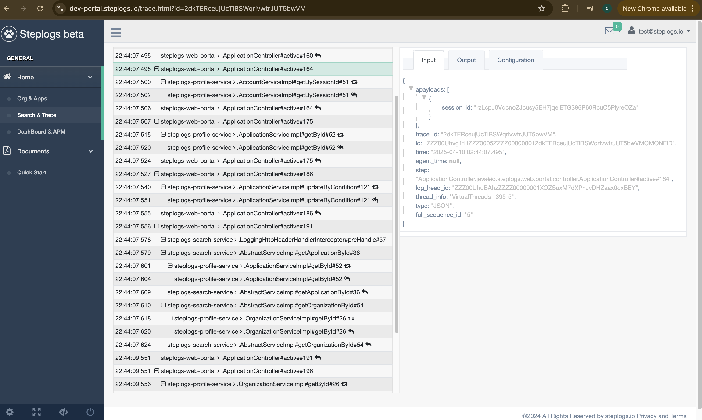

# For logger usage #

Why steplogs?

steplogs provides seamless way to print logs and sanitize sensitive/PII content, highly controllable traces.

1: logging/logger could be much ambiguous leading the troubleshoot very exhausted. with steplogs, just configuration can cover all of necessary logs. steplogs also support writing logs to the tracing by your own. -- even no need to write logs with proper configure.

2: When you have complicated business logic cross services, tracing the payloads would be much challenging. steplogs provides logging in language support(No need http proxy/servers) to capture the entire logic traces - no need to search logs any more although we provide.

3: when you sanitize sensitive/PII in the logs, the difficulty is you may do it before write into logs, or other assistances. Simple steplogs configurations can convert to the desired mask or encryption.

4: steplogs can co-exist with any logger like log4j, or no longer need these loggers.

More details please check out [www.steplogs.io](https://www.steplogs.io) and [steplogs-logging-integration-java-spring-example](https://github.com/FrankNPC/steplogs-logging-examples/tree/main/steplogs-logging-integration-java-spring-example) 


#### Introduce in maven ####

```
	<dependency>
		<groupId>io.steplogs</groupId>
		<artifactId>steplogs-logger</artifactId>
		<version>?</version>
	</dependency>
```

#### Configure Logger ####

It's better to start with spring, eee the example in spring [steplogs-logging-integration-java-spring-example](https://github.com/FrankNPC/steplogs-logging-examples/tree/main/steplogs-logging-integration-java-spring-example) 


### For Logging, there are two ways to use ###

- 1, On method

> `Annotate @Logging on the method/class to log the parameters/returns for the methods, by default`

```java
@Logging
TypeABC func(String str) { // line ~233
  // first line better right next
  //do some work
  return TypeABC
}
 
Object caller(){
  return func("str123");//line 456
}
```

> log: ...|package.class#func#233#|[str123]

> log: ...|package.class#func#233#R|[TypeABC->toJson]

Sample:
> 2025-03-30 19:15:37.151|VirtualThreads--69-5|7EHjY7VJ7WzVp4DEvL8AOutFo3wkyqlu|4-2|JSON|AccountServiceImpl.java#io.steplogs.profile.service.AccountServiceImpl#getBySessionId#51#|[{"session_id":"ZwQwpVLp7Ly26qP9JEu6QI8LqP5ttUgE87la4xDaqqoXB0ir"}]

> 2025-03-30 19:15:37.154|VirtualThreads--69-5|7EHjY7VJ7WzVp4DEvL8AOutFo3wkyqlu|4-3|JSON|AccountServiceImpl.java#io.steplogs.profile.service.AccountServiceImpl#getBySessionId#51#R|[[{"code":0,"entity":{"email":"test@steplogs.io","id":1,"login":"test@steplogs.io","organizationId":1,"password":null,"retries":0,"sessionId":"ZwQwpVLp7Ly26qP9JEu6QI8LqP5ttUgE87la4xDaqqoXB0ir","status":1,"timeCreated":1741873352},"message":null,"reason":null,"token":null}]]

> 2025-03-30 19:15:37.165|VirtualThreads--70-5|7EHjY7VJ7WzVp4DEvL8AOutFo3wkyqlu|6-2|JSON|OrganizationServiceImpl.java#io.steplogs.profile.service.OrganizationServiceImpl#getById#26#|[{"id":1}]

> 2025-03-30 19:15:37.167|VirtualThreads--70-5|7EHjY7VJ7WzVp4DEvL8AOutFo3wkyqlu|6-3|JSON|OrganizationServiceImpl.java#io.steplogs.profile.service.OrganizationServiceImpl#getById#26#R|[[{"code":0,"entity":{"accountId":1,"encryptionKey":"************************************************","id":1,"name":"steplogs","status":1,"timeCreated":1741873392},"message":null,"reason":null,"token":null}]]

`Tips for interface it needs AOP or proxy like spring pointcut`


- 2, In method

> `Annotate @Logging with catchLogging=true on the method/class to log the parameters/returns for the methods.`

```java
@Logging(catchLogging=true) 
TypeABC func(String str123) { // line 234
  //do some work
  Object obj = caller.call(str123); // line 278
  //do some work
  return TypeABC // line 299
}
 
Object call(){
  return func("str456");
}
```

> log: ...|package.class#func#278|[str123]

> log: ...|package.class#func#278R|[str456]

Sample:
> 2025-03-30 18:58:52.728|VirtualThreads--62-5|6xKDi88XSMMNlUdVDEuWwah3Tydcc59V|6|JSON|SearchController.java#io.steplogs.web.portal.controller.SearchController#fetchTrace#160|[1]

> 2025-03-30 18:58:52.738|VirtualThreads--62-5|6xKDi88XSMMNlUdVDEuWwah3Tydcc59V|7|JSON|SearchController.java#io.steplogs.web.portal.controller.SearchController#fetchTrace#160R|[[{"code":0,"entity":{"accountId":1,"encryptionKey":"Tmy3v0djPw8JlkUTlfIsu79dv4RMY4jo5XdN9ScvErUXp4xD","id":1,"name":"steplogs","status":1,"timeCreated":1741873392},"message":null,"reason":null,"token":null}]]

`Tips: take in mind of the sanitizer, in case SearchController requires encryptionKey to be masked`


## There are two ways to turn on the logging: ##

 * There are two ways to turn on the logging:
 * 1: Integrate steplogs-logger-spring-boot-starter with LoggerAutoConfiguration for AOP and proxy.
 * 2: To log methods on class instance not proxy, add io.steplogs.logger.spring.LoggingInitiationSpringApplicationRunListener to META-INF/spring.factories
 * Or, load agent before any classes: 
 
 ```
	public static void main(String[] args) {
		io.steplogs.logger.boostrap.LoggingInitiation.premain(null); // must load before everything, no need in steplogs-logger-spring-boot-starter
		new SpringApplicationBuilder(ServerBootApplication.class).run(args);
	}
```
 * Or, load the jar with javaagent: java -javaagent:steplogs-logger-1.0.1.jar= -jar your-app.jar

 * In general, above is enough,
 * X: For methods on interface with @Logging, or with JUnit, try proxy and AOP pointcut
 * Y: Annotate methods/classes/interfaces with @Logging, or manually add methods: io.steplogs.logger.boostrap.addTargetMethods/addTargetMethod/addClasses


---

### PII or sensitive info protection ###

 - sanitizer : /TYPE/Step/[placeholder: *]/MASK(key1|key2)/[placeholder: KEY-base62]/AES(key1|key2)
 - Always start with /, not end with /; can place multiple groups
 
> TYPE: in general it's JSON, could be ERROR or TEXT etc.

> Step: support wildcard match:
>> `/JSON/*Controller.java*controller.*Controller#*/*/MASK(encryptionKey)/*/MD5(sessionId|session_id)`

> placeholder: should be base 62 for [vector of md5/sha1 and key for AES]; may leave it empty then it will use default *

> Currently supported

```java
		EMPTY, -- set the string value of the keys to empty string
		SKIP, -- skip the value of the key so the log doesn't print it.
		POPULAR, -- capture it then scan the entire log to replace all. can use with others: POPULAR(MASK(key1))
		AES, -- AES encryption.
		MD5, -- MD5(key1) -> XWvr4b7h0XBFB79Irz1ny; MD5_1(key1) -> XWvr4b7h0XBFB79Irz1ny-423; 423 is the length of the original text
		SHA1, -- similar with MD5
		SHA256, -- similar with MD5
		MASK, -- Mask the value of the key:
			 */MASK(key1) -> ***123456 -> *****; 
			 */MASK_3(key1) -> 12345678 ->123***678; 12345 -> 123***45
```


### Trace ###

It's critical to pass and get the HTTP_HEADER_STEP_LOG_ID to the next service to form the trace. See steplogs-logger-spring-boot-starter/README.md


### After all, ###
** Search by keywords through the portal, or get X-Step-Trace-Id from HTTP response header like: X-Step-Trace-Id: aVhdzs1dSLryYzSKvmcKIbdtQRwDYrja **

** No quotas in configurations **

** parameters and returns are separated logging **


# For steplogs-logger-spring-boot-starter integration #

 - 1, introduce the jar, annotate beans with [@Logging](https://github.com/FrankNPC/steplogs-logger/blob/main/src/main/java/io/steplogs/logger/annotation/Logging.java)

```
	<dependency>
		<groupId>io.steplogs</groupId>
		<artifactId>steplogs-logger</artifactId>
		<version>?</version>
	</dependency>
	<dependency>
		<groupId>io.steplogs</groupId>
		<artifactId>steplogs-logger-spring-boot-starter</artifactId>
		<version>?</version>
	</dependency>
```


 - 2, configuration. see the explains in src/*/resource/application.xml, configure logger and app-node.
    -  import LoggerAutoConfiguration.class to declare default Logging.

 - 3, configure web server to pick up HTTP_HEADER_STEP_LOG_ID(X-Step-Log-Id) from the http request header. No need If with LoggerAutoConfiguration in spring web.
 
 - 4, configure the http client request to write HTTP_HEADER_STEP_LOG_ID(X-Step-Log-Id) header, so the next app/service can catch it into the traces
 
 - 5, configure [steplogs-logging-agent/application.xml](https://github.com/FrankNPC/steplogs-logging-examples/tree/main/steplogs-logging-agent), to upload the logs into steplogs.io for traces

 - 6: check out with search, or `https://portal.steplogs.io/trace.html?id=[TraceId/StepLogId]`.
 
#### see example [steplogs-logging-integration-java-spring-example](https://github.com/FrankNPC/steplogs-logging-examples/tree/main/steplogs-logging-integration-java-spring-example) ####


`Tip 1: Print X-Step-Trace-Id to the http response header might be helpful for debug, see LoggingHttpHeaderResponseAdvice`

`Tip 2: It's required to pass and read X-Step-Log-Id to/from the prev/next service so the traces can form as screenshot:`


See Sample: 

