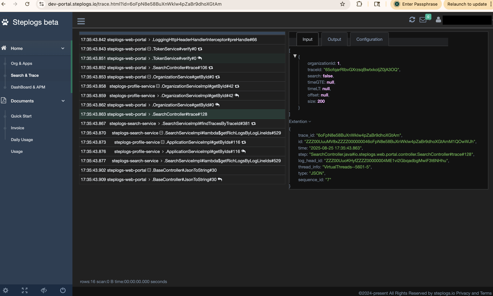

# For logger usage #

Introduce in maven

```
	<dependency>
		<groupId>io.steplogs</groupId>
		<artifactId>steplogs-logger</artifactId>
		<version>1.0.1</version>
	</dependency>
	
	...
	
	<repositories>
		<repository>
			<id>steplogs-private</id>
			<url>https://dl.cloudsmith.io/private/steplogs/private/maven/</url><!-- The repo url may change -->
			<releases>
				<enabled>true</enabled>
				<updatePolicy>always</updatePolicy>
			</releases>
			<snapshots>
				<enabled>true</enabled>
				<updatePolicy>always</updatePolicy>
			</snapshots>
		</repository>
	</repositories>
```

** For Logging, there are two ways to use **

- 1, On method

> `Annotate @Logging on the method/class to log the parameters/returns for the methods, by default`

```java
@Logging
TypeABC func(String str) { // line ~233
  // first line better right next
  //do some work
  return TypeABC
}
 
Object caller(){
  return func("str123");//line 456
}
```

> log: ...|package.class#func#233#|[str123]

> log: ...|package.class#func#233#R|[TypeABC->toJson]

Sample:
> 2025-03-30 19:15:37.151|VirtualThreads--69-5|7EHjY7VJ7WzVp4DEvL8AOutFo3wkyqlu|4-2|JSON|AccountServiceImpl.java#io.steplogs.profile.service.AccountServiceImpl#getBySessionId#51#|[{"session_id":"ZwQwpVLp7Ly26qP9JEu6QI8LqP5ttUgE87la4xDaqqoXB0ir"}]

> 2025-03-30 19:15:37.154|VirtualThreads--69-5|7EHjY7VJ7WzVp4DEvL8AOutFo3wkyqlu|4-3|JSON|AccountServiceImpl.java#io.steplogs.profile.service.AccountServiceImpl#getBySessionId#51#R|[[{"code":0,"entity":{"email":"test@steplogs.io","id":1,"login":"test@steplogs.io","organizationId":1,"password":null,"retries":0,"sessionId":"ZwQwpVLp7Ly26qP9JEu6QI8LqP5ttUgE87la4xDaqqoXB0ir","status":1,"timeCreated":1741873352},"message":null,"reason":null,"token":null}]]

> 2025-03-30 19:15:37.165|VirtualThreads--70-5|7EHjY7VJ7WzVp4DEvL8AOutFo3wkyqlu|6-2|JSON|OrganizationServiceImpl.java#io.steplogs.profile.service.OrganizationServiceImpl#getById#26#|[{"id":1}]

> 2025-03-30 19:15:37.167|VirtualThreads--70-5|7EHjY7VJ7WzVp4DEvL8AOutFo3wkyqlu|6-3|JSON|OrganizationServiceImpl.java#io.steplogs.profile.service.OrganizationServiceImpl#getById#26#R|[[{"code":0,"entity":{"accountId":1,"encryptionKey":"************************************************","id":1,"name":"steplogs","status":1,"timeCreated":1741873392},"message":null,"reason":null,"token":null}]]

`Tips 1: Due to the natural of java byte code, there might or not have a line number shift depend on the method declaration. So keep it the next line to the method will not trigger the issue`
`Tips 2: it doesn't work on interface and abstract methods, eg the RPC only has interfaces. will have to use option 2`


- 2, In method

> `Annotate @Logging with catchLogging=true on the method/class to log the parameters/returns for the methods.`

```java
@Logging(catchLogging=true) 
TypeABC func(String str123) { // line 234
  //do some work
  Object obj = caller.call(str123); // line 278
  //do some work
  return TypeABC // line 299
}
 
Object call(){
  return func("str456");
}
```

> log: ...|package.class#func#278|[str123]

> log: ...|package.class#func#278R|[str456]

Sample:
> 2025-03-30 18:58:52.728|VirtualThreads--62-5|6xKDi88XSMMNlUdVDEuWwah3Tydcc59V|6|JSON|SearchController.java#io.steplogs.web.portal.controller.SearchController#fetchTrace#160|[1]

> 2025-03-30 18:58:52.738|VirtualThreads--62-5|6xKDi88XSMMNlUdVDEuWwah3Tydcc59V|7|JSON|SearchController.java#io.steplogs.web.portal.controller.SearchController#fetchTrace#160R|[[{"code":0,"entity":{"accountId":1,"encryptionKey":"Tmy3v0djPw8JlkUTlfIsu79dv4RMY4jo5XdN9ScvErUXp4xD","id":1,"name":"steplogs","status":1,"timeCreated":1741873392},"message":null,"reason":null,"token":null}]]

`Tips: take in mind of the sanitizer, in case SearchController needs encryptionKey`


## There are three ways to turn on the logging: ##

 * There are three ways to turn on the LoggingInitiation for logging:
 * 1: For methods on classes annotated with @Logging, to load the jar with javaagent: java -javaagent:steplogs-logger-1.0.1.jar= -jar your-app.jar
 * 2: For methods on classes annotated with @Logging, to load agent before your classes: 
 
 ```
	public static void main(String[] args) {
		io.steplogs.logger.boostrap.LoggingInitiation.premain(null); // must load before everything
		new SpringApplicationBuilder(ServerBootApplication.class).run(args);
	}
```

 * 3: Integrate steplogs-logger-spring-boot-starter lib, place a file src/main/resources/META-INF/spring.factories with org.springframework.boot.SpringApplicationRunListener=io.steplogs.logger.spring.LoggingInitiationSpringApplicationRunListener


 * X: For methods on classes not annotated with @Logging, or on interface, use AOP proxy and pointcut: io.steplogs.logger.spring.LoggingMethodPointcut
 * Y: For methods on classes not annotated with @Logging, manually add methods: io.steplogs.logger.boostrap.addTargetMethods/addTargetMethod/addClasses
 * Z: Only public and static methods supported except to AOP/proxy in honor of private, protected and final

---

### PII or sensitive info protection ###

 - sanitizer : /TYPE/Step/[placeholder: *]/MASK(key1|key2)/[placeholder: KEY-base62]/AES(key1|key2)
 - Always start with /, not end with /; can place multiple groups
 
> Type: in general JSON, could be ERROR or TEXT 

> Step: support wildcard match:

> placeholder: should be base 62 for [vector of md5/sha1 and key for AES]; may leave it empty then it will use default *

> `/JSON/*Controller.java*controller.*Controller#*/*/MASK(encryptionKey)/*/MD5(sessionId|session_id)`


### After all, ###
** Search by keywords through the portal, or get the id from HTTP response header like: X-Step-Trace-Id: aVhdzs1dSLryYzSKvmcKIbdtQRwDYrja **

** If beans are not marked @Logging, try LoggingMethodPointcut with steplogs-logger-spring-boot-starter **

** No quotas in configurations **

** parameters and returns are separated logging **


# For steplogs-logger-spring-boot-starter integration #

 - 1, introduce the lib with spring, mark beans with [@Logging](https://github.com/FrankNPC/steplogs-logger/blob/main/src/main/java/io/steplogs/logger/annotation/Logging.java)

```
pom.xml:

	<dependency>
		<groupId>io.steplogs</groupId>
		<artifactId>steplogs-logger</artifactId>
		<version>1.0.1</version>
	</dependency>
	<dependency>
		<groupId>io.steplogs</groupId>
		<artifactId>steplogs-logger-spring-boot-starter</artifactId>
		<version>1.0.1</version>
	</dependency>
	
	...
	
	<repositories>
		<repository>
			<id>steplogs-private</id>
			<url>https://dl.cloudsmith.io/private/steplogs/private/maven/</url><!-- The repo url may change -->
			<releases>
				<enabled>true</enabled>
				<updatePolicy>always</updatePolicy>
			</releases>
			<snapshots>
				<enabled>true</enabled>
				<updatePolicy>always</updatePolicy>
			</snapshots>
		</repository>
	</repositories>
```

```
settings.xml:

	<servers>

		<server>
			<id>cloudsmith</id>
      		<username>${cloudsmith.username}</username><!-- see it in portal under your organization, also may change -->
			<password>${cloudsmith.password}</password><!-- see it in portal under your organization, also may change -->
		</server>
		
	</servers>
	
```


 - 2, configuration. see the explains in src/*/resource/application.xml, configure logger and app-node.
    -  import LoggerAutoConfiguration.class to declare Logging and LoggerProvider bean etc.
    -  more configuration see [steplogs-logging-integration-java-spring-example](https://github.com/FrankNPC/steplogs-logging-examples/tree/main/steplogs-logging-integration-java-spring-example)

 - 3, configure web server to pick up HTTP_HEADER_STEP_LOG_ID from the http request header, and setup to the logger as log id
 
 - 4, configure the http client request to write HTTP_HEADER_STEP_LOG_ID to the header, so the next app/service can catch it into the traces

 - 5, configure [steplogs-logging-agent/application.xml](https://github.com/FrankNPC/steplogs-logging-examples/tree/main/steplogs-logging-agent), to upload the logs into steplogs.io for traces

 - 6: check out with search, or `https://portal.steplogs.io/trace.html?id=[TraceId/StepLogId]`.


`Tips: `

`Print X-Step-Trace-Id to the http response header might be helpful for debug, see LoggingHttpHeaderResponseAdvice`

`The key point is it requires picking up and passing X-Step-Log-Id to the prev/next service so the traces can form as screenshot:`


See Sample: 

